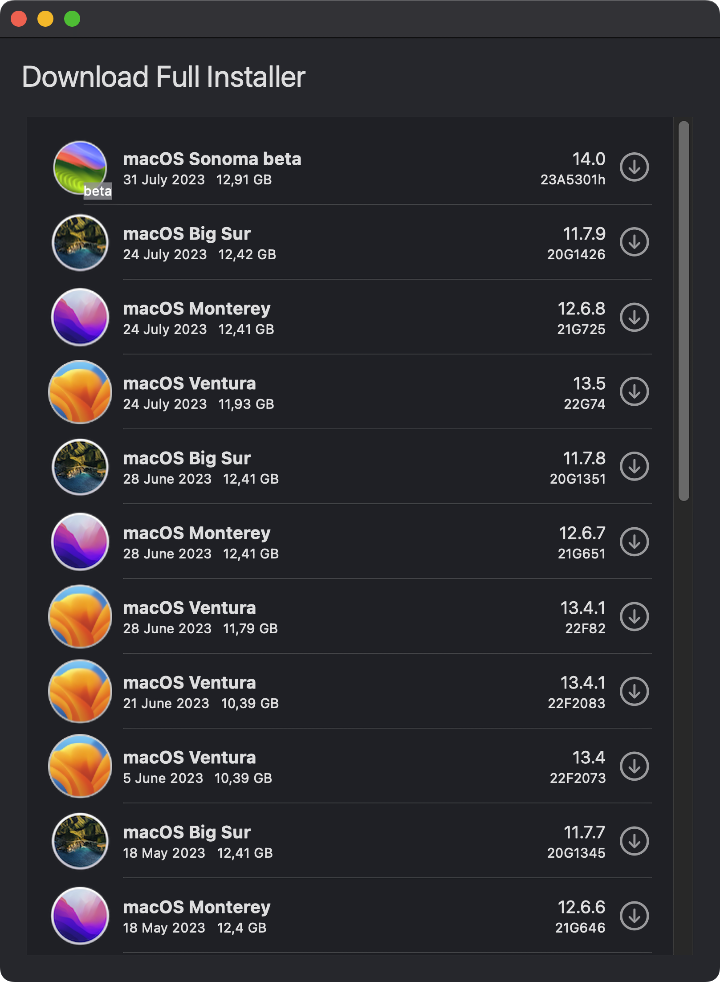

# Download Full Installer

&nbsp;&nbsp;



This is a Swift UI implementation of my [fetch-installer-pkg](https://github.com/scriptingosx/fetch-installer-pkg) script. It will list the full macOS Big Sur (and later) installer pkgs available for download in Apple's software update catalogs.

You can then choose to download one of them.

### Motivation

You may want to download the installer pkg instead of the installer application directly, because you want to re-deploy the installer application with a management system, such as Jamf. 

Since the Big Sur macOS installer application contains a single file larger than 8GB, normal packaging tools will fail. I have described the problem and some solutions in detail in [this blog post](https://scriptingosx.com/2020/11/deploying-the-big-sur-installer-application/).

### Extras

- Copy the download URL for a given installer pkg from the context menu.

- Change the seed program in the Preferences window.

### Questions

#### Is this different than the fetch-installer-pkg script?

Not really, other than it is a UI app and written in Swift and SwiftUI instead of a command line script written in python. I used this as a project to learn more about SwiftUI.

#### Can this download older versions of the macOS installer application?

No. Apple only provides installer pkgs for Big Sur and later. Earlier versions of the Big Sur installer are removed regularly.

#### Will you update this so it can download older versions?

No.

#### How is this different than `softwareupdate` or `installinstallmacOS.py`

As far as I can tell, this downloads the same pkg as `softwareupdate --fetch-full-installer` and `installinstallmacOS.py`.

The difference is that the other tools then immediately perform the installation so that you get the installer application in the `/Applications` folder. This tool just downloads the pkg, so you can use it in your management system, archive the installer pkg, or manually run the installation.

#### Skip sleep while downloading the installer

Download Full Installer does not prevent the system from going to sleep while an installer is being downloaded. You can prevent this with the macOS caffeinate command. Its use is relatively simple:

- open Terminal
- type `top | grep "Download"`
- stop top with Ctrl + C
- the output shows at the beginning of each line the PID of Download Full Installer
- type `caffeinate -w PID`(where PID is a number)
- sleep is suppressed until Download Full Installer is closed.

``` bash
/Users/yo > top | grep "Download"
2233  Download Full In (more text...)
^C
/Users/yo > caffeinate -w 2233

```

### Credit

Both [fetch-installer-pkg](https://github.com/scriptingosx/fetch-installer-pkg) and this application are based on [Greg Neagle's installinstallmacos.py](https://github.com/munki/macadmin-scripts/blob/main/installinstallmacos.py) script.
